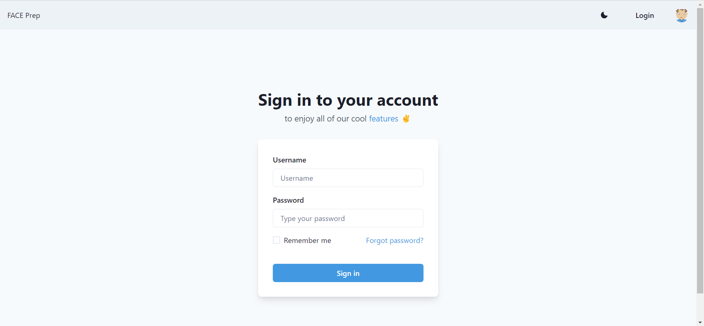
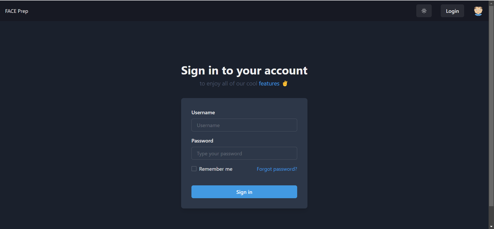
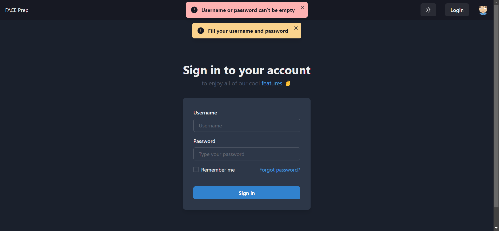
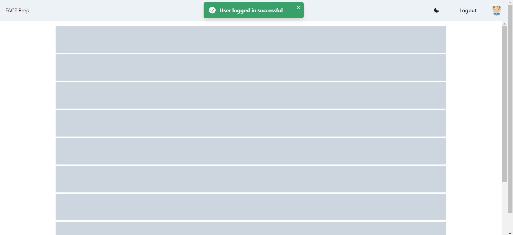
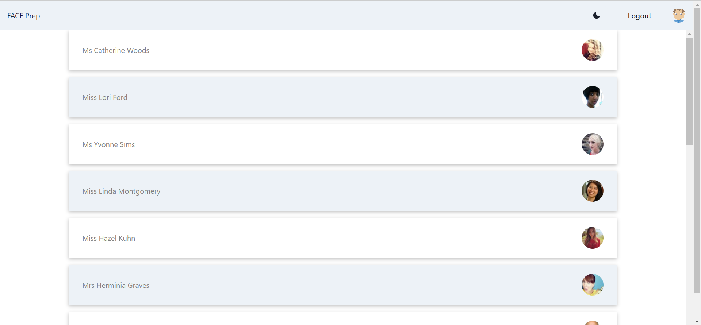
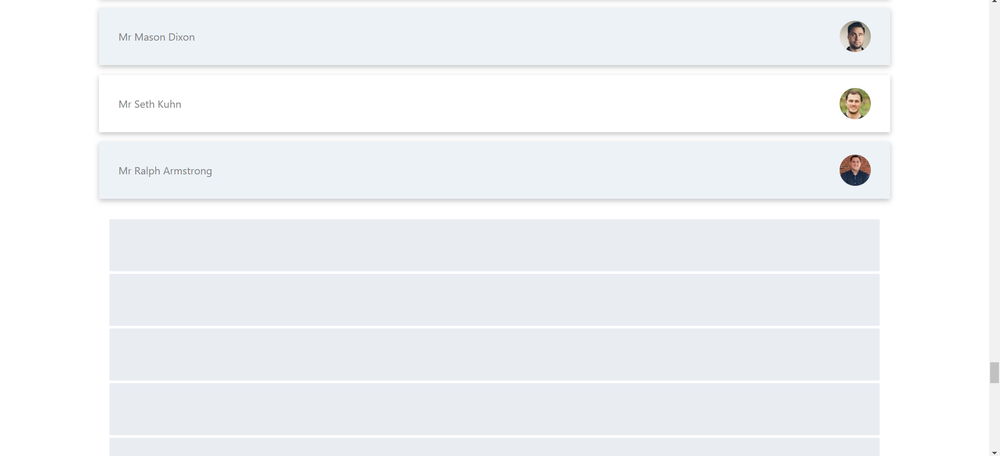
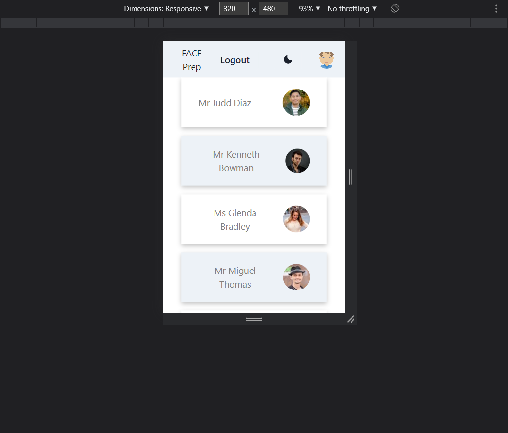
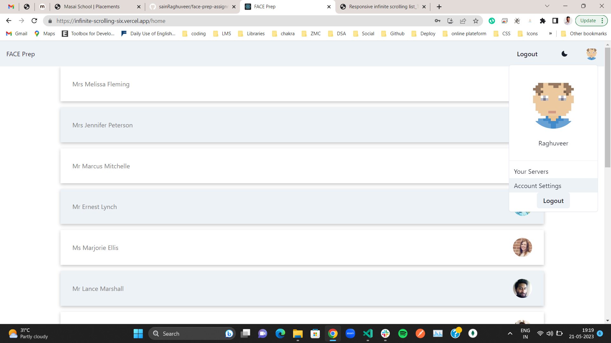
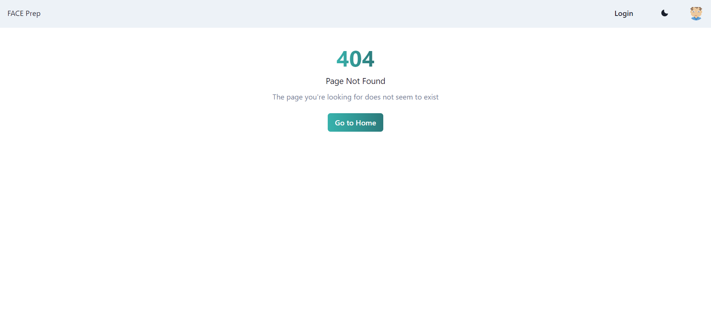

# FACEprep assignment

<br>

## What we will use and what we can do ?
- this app will be infinite scrolling app that are authenticated app
- for frontend we will use react
- for maintaining state will will be using redux
- this will be authenticated app you can't access without username password
- for example you can use like this credentials
```js
username=raghuveersain
password=12345
```
- other than that you can use your own credentials but you have to login first then you can use this app
- this app will have two route one is default login route
- one route is home that will accessible for those user that are logged in only
- For authentication we are using redux that will take care of isAuth
- home page is wrapped under private route you can't access without logged in
 - If you will try to log in without givin username password it will not allow you to go to home page

## Getting Started
- to start this project clone this repo in your local system
```js
https://github.com/sainRaghuveer/face-prep-assignment.git
```
- then run this commands for getting started


```js
npm install
```

- this will install all dependencies


<br>

## Dependencies
- These dependencies we will be need during this project

### Dependencies for frontend if we are using ChakraUi in react application and redux
```js
"dependencies": {
    "@chakra-ui/icons": "^2.0.19",
    "@chakra-ui/react": "^2.6.1",
    "@emotion/react": "^11.11.0",
    "@emotion/styled": "^11.11.0",
    "@testing-library/jest-dom": "^5.16.5",
    "@testing-library/react": "^13.4.0",
    "@testing-library/user-event": "^13.5.0",
    "axios": "^1.4.0",
    "framer-motion": "^10.12.12",
    "react": "^18.2.0",
    "react-dom": "^18.2.0",
    "react-infinite-scroll-component": "^6.1.0",
    "react-redux": "^8.0.5",
    "react-router-dom": "^6.11.2",
    "react-scripts": "5.0.1",
    "redux": "^4.2.1",
    "redux-thunk": "^2.4.2",
    "web-vitals": "^2.1.4"
  }
```


<br>

# Screenshot
- here is one screenshot you can see
## This will be default Route if anyone wants to access home page need to authenticate


<br>

## Application available in both light and dark theme


## This will be Login form need to login first you can use any kind of username and password but without logged in you can't access anything


<br>

## If you will try to login without giving username and password or if you will try to login it will show you this type of error


## When you will put username and password you will be redirected to this home page and if data is loading you will see skeleton


<br>

## This is initial user data you will see it will be 20 data in first go


<br>

## When you will scroll down to last data it will show you skeleton for 1 second while more data get fetched then it will show you more this is how it will keep load new data everytime


<br>

## this is compatible to every type of screen it will compatible to laptop and tablet and mobile also, you can see here it is compatible for atleast 320*480 sized view port


<br>

## you can click on user face to see user information you will get to see your username that you used while logging in and after click on logged in you will be redirected to login page again


<br>

## If you will try to go any other route that are not present in application you will get to see 404 page



<br>


